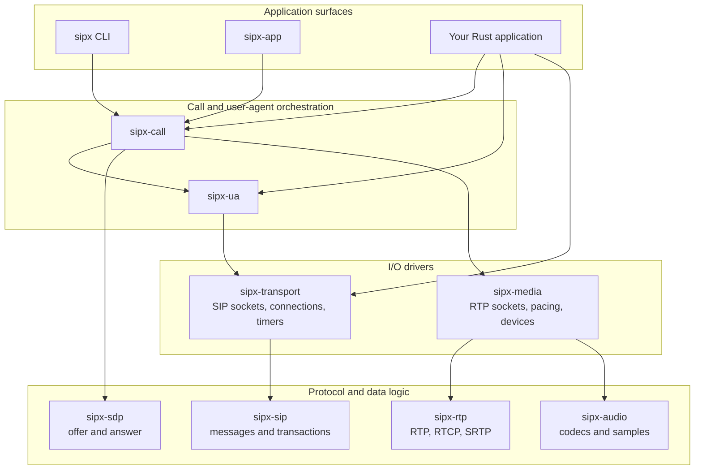

# Architecture and layers

sipx separates protocol decisions from operating-system effects. The SIP and SDP cores receive
data, make a deterministic decision, and return data or actions. They do not open sockets, spawn an
async runtime, or read a clock. Drivers above them own the network, timers, and media devices.

This style is usually called **sans-I/O**: the difficult state machine is a library, while the code
that waits for the outside world is a replaceable driver. It is the central boundary in sipx, not
just a testing convenience.

## The layers

The arrows mean “uses,” not “sends packets to.” A call composes signalling and media policy;
`sipx-transport` and `sipx-media` are the layers that actually perform asynchronous I/O.

Two crates carry the strict sans-I/O guarantee:

- `sipx-sip` parses and serializes messages and runs the client and server transaction state
  machines. Bytes enter as data. Time enters as a notification that a named timer fired. The crate
  returns messages to send and timers to arm.
- `sipx-sdp` parses session descriptions and computes offer/answer results as pure functions. It
  does not bind the media address it negotiates or start the media it describes.

The drivers translate between those values and the outside world:

- `sipx-transport` owns SIP sockets, connection pooling, target resolution, and the endpoint timer
  queue. It feeds received bytes and fired timers into `sipx-sip`, then performs the resulting sends
  and timer operations.
- `sipx-media` owns RTP and RTCP sockets, packet pacing, capture, playback, and media-session
  lifetime. It composes packet and protection rules from `sipx-rtp` with sample and codec operations
  from `sipx-audio`.

`sipx-ua` adds registration, authentication, subscriptions, publications, and answering policy.
`sipx-call` joins user-agent signalling, SDP negotiation, and media sessions into dialogs and calls.
Applications can use any of these layers directly; the CLI and `sipx-app` are complete surfaces built
from the same public crates.

## What the boundary buys

### Deterministic time

A SIP transaction can ask for a retransmission timer without knowing how time is measured. A test
can advance a virtual clock directly to that deadline, fire the timer, and inspect the exact output.
It does not sleep and hope the scheduler happens to produce the intended ordering. The production
driver supplies the same input from its monotonic timer queue.

### Focused fuzzing

The parsers and transaction machines accept ordinary values rather than requiring a live endpoint.
Fuzz targets can feed malformed bytes, arbitrary stream boundaries, and unusual event sequences
straight into the code under test. They do not need ports, background tasks, or cleanup machinery,
so a failure is reproducible from its input alone.

### Tests without a network

Most signalling behavior can be tested as a sequence of bytes, messages, timer events, and expected
actions. `sipx-testkit` extends that boundary with a seeded fault link and nanosecond virtual time for
application-call tests. Real-socket and independent-peer tests still exist for the driver boundary;
they prove the integration rather than carrying every state-machine case.

### More than one driver

Because the core does not own a socket or runtime, an application can drive it from a normal async
endpoint, a deterministic harness, or another host environment without copying SIP transaction or
SDP logic. The driver remains responsible for bounded work, cancellation, clocks, entropy, and every
other effect the core deliberately does not perform.

## Which crate should I use?

| You want to… | Start with |
|---|---|
| Parse, validate, build, or proxy SIP messages | `sipx-sip` |
| Compute or inspect SDP offer/answer | `sipx-sdp` |
| Bind a SIP endpoint or control transports and connections | `sipx-transport` |
| Register, authenticate, subscribe, publish, or answer requests | `sipx-ua` |
| Dial, answer, hold, transfer, record, or otherwise manage calls | `sipx-call` |
| Parse RTP/RTCP, protect packets, or handle telephone events | `sipx-rtp` |
| Encode, decode, mix, or read and write audio samples | `sipx-audio` |
| Run a paced RTP media session, playback, capture, bridge, or conference | `sipx-media` |
| Drive calls from a process-level application contract | `sipx-app` and `sipx-app-protocol` |
| Test call behavior with virtual time and controlled faults | `sipx-testkit` |
| Operate or diagnose an endpoint from a shell | the `sipx` CLI |

For dependencies, feature boundaries, and direct API links, continue with
[Use sipx as a Rust library](guides/as-a-library.md). For how specifications, vectors, tests, and the
release gate hold these layers together, see [How sipx is built](reference/development-process.md).
